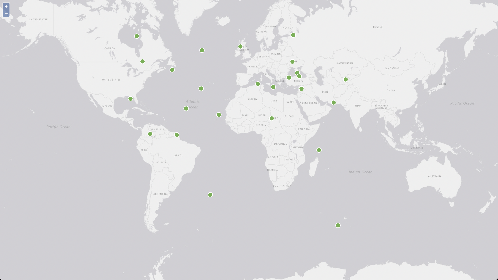

# Openlayers usage example in Next.JS

This is an example of how to use Openlayers in Next.js. It allows users to view a map of the world and select a location and add it to the map. Locations are saved in memory for showcase.



## Getting Started

First, run the development server:

```bash
yarn dev
```
